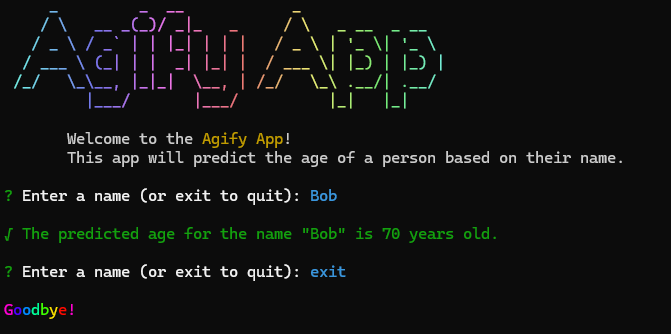

# Ageify App



This is a simple command-line application that uses the [Ageify API](https://agify.io/) to estimate an age based on the inputted name. The application is built using Node.js, Chalk, Inquirer, Gradient String, Chalk Animation, Figlet, and Nanospinner.

To run the application, clone the repository and type in the terminal:

```bash
npm install
```

```bash
node .
```